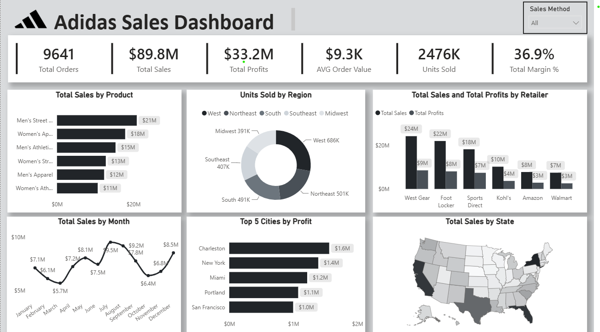

# 👟 Adidas US Sales Performance & Profitability Dashboard



---

## 📌 Executive Summary & Project Overview
This business intelligence dashboard analyzes nationwide sales performance, profitability margins, and product demand for **Adidas** across the United States. Built using **Power BI Desktop**, the report provides strategic insights into channel distribution, geographic concentration, seasonality, and retailer contributions to empower executive decision-making.

---

## 🎯 Key Performance Indicators (KPIs)
* **Total Sales Revenue:** $89.8 Million
* **Total Operating Profit:** $33.2 Million
* **Overall Profit Margin:** 36.9%
* **Total Units Sold:** 2,476K Units (2.47M items)
* **Total Completed Orders:** 9,641 Orders
* **Average Order Value (AOV):** $9.3K

---

## 🔍 In-Depth Analytical Breakdown

### 1. Product Category Performance
* **Men's Street Footwear** dominates revenue generation at **$21M**, followed by **Women's Apparel** at **$18M**.
* Athletic lines show steady demand: Men's Athletic Footwear (**$15M**), Women's Street Footwear (**$13M**), Men's Apparel (**$12M**), and Women's Athletic Footwear (**$11M**).

### 2. Retailer Contribution & Channel Profitability
* **West Gear** is the top retail partner generating **$24M** in sales and **$9M** in profits.
* **Foot Locker** follows closely with **$22M** in sales and **$8M** in operating profits.
* **Sports Direct** generated **$18M** ($7M profit), while **Kohl's**, **Amazon**, and **Walmart** accounted for **$10M**, **$8M**, and **$7M** respectively.

### 3. Regional Volume & Geographic Footprint
* **Top Region by Volume:** The **West Region** leads with **686K units sold**, followed by the **Northeast** (501K units) and **South** (491K units).
* **Top 5 Cities by Profit:**
  1. **Charleston:** $1.6M
  2. **New York:** $1.4M
  3. **Miami:** $1.2M
  4. **Portland:** $1.1M
  5. **San Francisco:** $1.0M

### 4. Seasonality & Sales Trends
* **Peak Months:** Strong demand surge during mid-year summer months, peaking in **July ($9.5M)** and **August ($9.2M)**.
* **End-of-Year Rebound:** Clear holiday season lift reaching **$8.5M in December**.
* **Troughs:** Lower purchasing activity observed in **March ($5.7M)** and **October ($6.4M)**.

---

## 📐 Key DAX Measures Used

```dax
Total Sales = SUM(Sales[Total_Sales])
```

```dax
Total Profits = SUM(Sales[Operating_Profit])
```

```dax
Total Margin % = DIVIDE([Total Profits], [Total Sales], 0)
```

```dax
AVG Order Value = DIVIDE([Total Sales], DISTINCTCOUNT(Sales[Invoice_Date]), 0)
```

```dax
Units Sold = SUM(Sales[Units_Sold])
```

---

## 💡 Strategic Business Recommendations
1. **Strengthen Street Footwear Inventory:** Maintain optimal stock availability for Men's Street Footwear as it drives the highest revenue ($21M).
2. **Prioritize Tier-1 Retail Partnerships:** West Gear and Foot Locker generate over 51% of total retailer revenue; allocate priority marketing resources to these partners.
3. **Summer Campaign Alignment:** Align advertising spend ahead of the July–August surge to maximize Q3 revenue capture.
4. **Western Distribution Optimization:** With the West region commanding the largest sales volume (686K units), ensure warehouse fulfillment speed is prioritized.

---

## 📥 How to Run Locally
1. Clone or download this repository.
2. Make sure you have **Power BI Desktop** installed.
3. Open the `.pbix` file from the repository files list above to explore the interactive dashboard.
